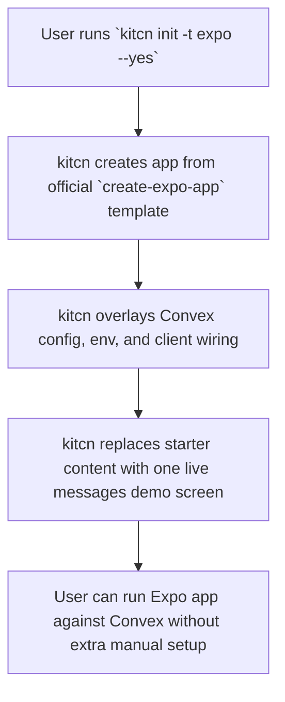

# Expo Template

## Problem Frame

`kitcn init -t` currently has web-first fresh-app scaffolds (`next`, `start`,
`vite`) plus auth layering that assumes web/react project shapes. There is no
first-class Expo lane, so mobile users either start elsewhere or force a web
template into a native-shaped app.

The goal is to add a first-party Expo template that feels like current kitcn
templates: start from an official upstream shell, overlay the minimum kitcn
Convex wiring, and prove the app is real with one tiny live demo. V1 should
solve fresh mobile bootstrap only. It should not drag in auth, styling stack
wars, or existing-app adoption.

## Requirements

**Official Base**
- R1. `kitcn init -t expo` must scaffold from the official Expo CLI path rather
  than from a kitcn-owned handwritten Expo shell.
- R2. V1 must use `create-expo-app` as the source of truth for the app shell,
  mirroring the repo's shadcn-owned Next approach.
- R3. As of April 18, 2026, the intended upstream base is
  `create-expo-app --template default@sdk-55`; planning must verify that this
  still matches Expo's current official recommendation before implementation.

**Generated App Shape**
- R4. The generated app must be a fresh Expo Router app with a single-screen
  shell, not tabs or drawer navigation.
- R5. kitcn must overlay the minimum Convex runtime wiring needed for a working
  native app instead of replacing the whole Expo project structure.
- R6. The scaffolded app must include one live Convex-backed messages screen
  with list and create behavior, matching the current tiny demo posture used in
  other kitcn templates.
- R7. The demo should replace upstream starter content enough that the scaffold
  clearly reads as a kitcn+Convex app rather than a stock Expo welcome screen.

**Scope and Compatibility**
- R8. V1 must support fresh scaffolding only via `kitcn init -t expo`.
- R9. V1 must not include auth scaffolding, auth-ready shell behavior, or
  `kitcn add auth` support for Expo.
- R10. V1 must not pick a styling system beyond the official Expo baseline; no
  NativeWind, Unistyles, or other opinionated styling stack should be part of
  the initial template.
- R11. Planning must treat existing Expo app adoption as a separate future lane,
  not as hidden scope inside this template work.

**CLI Contract**
- R12. `kitcn init` help, template validation, and machine-readable output must
  recognize `expo` as a supported fresh-app template.
- R13. Repo project detection and scaffold-context logic must gain an explicit
  Expo/native lane rather than misclassifying Expo as generic React or leaving
  it unsupported.
- R14. The Expo template must preserve current kitcn expectations around
  deterministic `--yes` behavior and fresh-app bootstrap flow.

## Success Criteria
- `kitcn init -t expo --yes` produces a runnable Expo app with Convex wired in.
- The generated app opens to one live messages screen backed by Convex.
- The implementation keeps Expo shell ownership upstream and keeps kitcn-owned
  changes narrowly scoped to overlay files and minimal patch points.
- V1 does not accidentally expand into auth, existing-app adoption, tabs/drawer
  shells, or styling-framework decisions.

## Scope Boundaries
- No Expo auth support in v1.
- No `kitcn add auth` Expo path in v1.
- No existing Expo app adoption in v1.
- No tabs or drawer starter shell in v1.
- No NativeWind, Unistyles, or other opinionated mobile styling layer in v1.
- No attempt to reuse `create-better-t-stack` as the generator source of truth.

## Key Decisions
- Official Expo base wins: use `create-expo-app`, not a kitcn-owned Expo shell.
- kitcn overlays Convex onto the upstream app instead of replacing the app
  structure wholesale.
- V1 is fresh scaffold only: adoption work is deferred.
- V1 is unauthenticated: auth is intentionally out of scope.
- Demo shape is the existing tiny messages pattern: enough proof, low carrying
  cost.
- `create-better-t-stack` is a donor for Expo choices when useful, not the
  baseline owner.

## Dependencies / Assumptions
- Expo's official template contract remains stable enough to wrap from the CLI.
- The repo is willing to add a native/Expo project-context lane in CLI
  detection and scaffold planning.
- Convex's current React/React Native client surface is sufficient for a simple
  Expo messages demo without introducing auth-specific runtime dependencies.

## Outstanding Questions

### Deferred to Planning
- [Affects R1][Technical] Which exact files from the official Expo scaffold
  should stay upstream-owned versus receive kitcn overlay patches?
- [Affects R5][Technical] What is the smallest durable scaffold-context model
  for Expo/native without contorting the current `next-app` vs `react` split?
- [Affects R6][Technical] Which existing messages demo assets can be reused
  directly versus needing Expo-native variants?
- [Affects R12][Needs research] Which current CLI tests should be mirrored for
  Expo template bootstrap, detection, and JSON output?
- [Affects R3][Needs research] At implementation time, does Expo still
  recommend `default@sdk-55`, or has the official template target changed?

## Next Steps
→ `/ce:plan` for structured implementation planning
