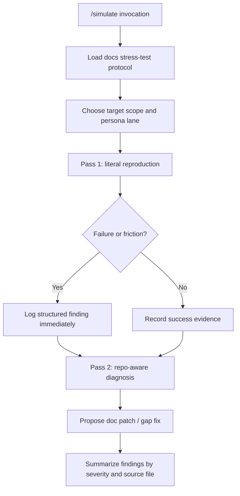

# fix: Replace stale simulate command with a docs stress-test workflow

## Overview

Replace the stale `.claude/commands/simulate.md` “build a giant demo app”
prompt with a real docs stress-test workflow that simulates both a literal human
follower and an agent follower, exercises the published bootstrap path and local
runtime path separately, and produces actionable doc-gap findings instead of
cargo-cult busywork.

## Problem Frame

The current `simulate.md` is lying about its purpose. It claims to simulate
onboarding, but it actually forces a four-phase product build in a temp repo,
uses dead planning-file conventions, and forbids the exact repo-aware diagnosis
work needed to turn failures into useful doc patches.

That drift matters because recent breakages have come from the docs/runtime seam
rather than from framework theory:

- fresh-app bootstrap drift (`kitcn@latest`, published tarball behavior,
  anonymous Convex init)
- local-runtime drift (`kitcn dev`, `kitcn add ...`, `kitcn verify`)
- doc parity drift between `www/content/docs/**` and
  `packages/kitcn/skills/kitcn/**`
- “looks fine in the repo” failures that only show up when a user follows the
  docs literally in a blank app

The current command is too stale, too specific, and too eager to build random
product surface area that tells us nothing about whether the docs are actually
safe to follow.

## Requirements Trace

- R1. The replacement command must simulate a docs consumer, not a product
  author.
- R2. The workflow must support both a human-like literal follower and an
  agent-like follower.
- R3. The workflow must validate published bootstrap commands separately from
  local project commands.
- R4. The workflow must log structured findings with exact doc source, failed
  step, observed behavior, workaround, and proposed patch.
- R5. The command must stay maintainable; durable policy should not live only in
  one giant command prompt.
- R6. The workflow must explicitly target the current live docs surfaces in
  `www/content/docs/**` and the synced Convex skill docs in
  `packages/kitcn/skills/kitcn/**`.
- R7. The workflow must preserve fidelity during reproduction and still allow a
  second diagnosis pass that proposes grounded fixes.

## Scope Boundaries

- Do not turn this into a general-purpose “ship a demo SaaS app” command again.
- Do not add CI automation or permanent runtime harnesses in this pass.
- Do not rewrite all docs as part of the command rewrite itself.
- Do not keep legacy `planning-with-files`, `task_plan.md`, `progress.md`, or
  `findings.md` conventions alive inside the new command.
- Do not let the simulator silently use source knowledge during the literal
  reproduction pass.

## Context & Research

### Relevant Code and Patterns

- `.claude/commands/simulate.md` is the stale source being replaced.
- `.claude/commands/plan.md` shows the healthier “thin command” pattern.
- `.claude/commands/clean-docs.md` shows how these internal commands can frame a
  repo task without embedding product logic.
- `docs/solutions/simulate-doc.md` is an older docs-testing artifact, but it is
  also stale and scoped to a historical quickstart flow.
- `docs/plans/2026-01-23-fix-quickstart-documentation-gaps-plan.md` proves the
  repo already wanted a simulation lane, but the artifacts drifted.

### Institutional Learnings

- `docs/solutions/integration-issues/bootstrap-docs-must-use-latest-remote-cli-but-local-runtime-commands-stay-local-20260331.md`
  defines the remote-bootstrap vs local-runtime split the simulator must prove.
- `docs/solutions/integration-issues/published-cli-bootstrap-must-ship-runtime-deps-and-anonymous-convex-init-20260331.md`
  shows why a fresh blank-app path must be treated as first-class evidence, not
  an afterthought.

### External References

- None needed. This is an internal workflow repair, not a framework research
  problem.

## Key Technical Decisions

- **Hard-cut the command purpose**: `simulate.md` should validate docs, not ship
  a fantasy demo app. The old four-phase product gauntlet gets deleted.
- **Make the command thin**: keep the invocation contract in
  `.claude/commands/simulate.md`, but move durable workflow policy into a
  dedicated protocol doc at `docs/analysis/docs-stress-test-protocol.md` so the
  command body stops rotting.
- **Use a two-pass model**: first pass is strict reproduction with docs-only
  guidance; second pass is repo-aware diagnosis that converts breakages into
  patch suggestions.
- **Treat bootstrap and runtime as different contracts**: the simulator must
  explicitly test `kitcn@latest` blank-directory setup separately from local
  project commands like `kitcn dev`, `kitcn add`, and `kitcn verify`.
- **Findings are the primary output**: a working app is evidence, not the goal.
  The real deliverable is a prioritized report tied back to the exact doc
  sections that misled the user.
- **Cover both docs surfaces deliberately**: `www` is the user-facing canon, and
  `packages/kitcn/skills/kitcn/**` is the agent-facing compressed canon. The
  simulator should pressure both, not pretend only one matters.

## Open Questions

### Resolved During Planning

- **Should `simulate.md` stay a fat prompt?** No. That is exactly why it went
  stale.
- **Should the simulator be allowed to inspect repo code?** Yes, but only after
  the literal reproduction pass has already logged the failure. Reproduction and
  diagnosis should not be mixed.
- **Should the workflow try to test the whole docs corpus every run?** No. The
  command should support scoped runs and a prioritized matrix, otherwise it
  becomes an expensive hallucination machine.
- **Should the old `docs/solutions/simulate-doc.md` remain the source of truth?**
  No. It is a stale workflow artifact in the wrong bucket.

### Deferred to Implementation

- **Invocation syntax details**: whether the command accepts freeform targets,
  named lanes, or both should be finalized while writing the actual prompt.
- **Report filename/location inside the temp workspace**: the plan defines the
  schema, but the exact artifact path can be picked during implementation.

## High-Level Technical Design

> _This illustrates the intended approach and is directional guidance for
> review, not implementation specification. The implementing agent should treat
> it as context, not code to reproduce._

## Implementation Units

- [ ] **Unit 1: Hard-cut the stale command contract**

**Goal:** Rewrite `.claude/commands/simulate.md` so it stops prescribing a
four-phase product build and instead invokes a docs stress-test workflow.

**Requirements:** R1, R3, R5

**Dependencies:** None

**Files:**

- Modify: `.claude/commands/simulate.md`

**Approach:**

- Delete the current battle-test framing, old temp-path assumptions, and dead
  planning-file requirements.
- Reframe the command around doc validation lanes, findings output, and scoped
  targets.
- Keep the command short enough that future updates change policy in one place,
  not inlined across a wall of prompt prose.

**Patterns to follow:**

- `.claude/commands/plan.md`
- `.claude/commands/clean-docs.md`

**Test scenarios:**

- Test expectation: none -- prompt-only command contract, no code-bearing test
  seam.

**Verification:**

- Reading `.claude/commands/simulate.md` shows a docs stress-test invocation,
  not a staged app-build prompt.
- The command no longer references `planning-with-files`, `task_plan.md`,
  `progress.md`, `findings.md`, or `/tmp/simulation-1`.

- [ ] **Unit 2: Create a durable docs stress-test protocol**

**Goal:** Move the reusable simulation rules, personas, and findings contract
into one maintained reference document instead of burying them inside the
command body.

**Requirements:** R2, R4, R5, R7

**Dependencies:** Unit 1

**Files:**

- Create: `docs/analysis/docs-stress-test-protocol.md`
- Modify: `.claude/commands/simulate.md`

**Approach:**

- Define two lanes explicitly:
  - human-like literal follower
  - agent-like follower
- Define the hard boundary between reproduction and diagnosis:
  - reproduction: docs-only, minimal inference, log confusion before
    improvising
  - diagnosis: repo-aware investigation allowed only after the failure is
    captured
- Define one structured findings schema with required fields:
  severity, persona, target doc, exact step/section, expected behavior, actual
  behavior, workaround, likely root cause, proposed patch.

**Patterns to follow:**

- `docs/solutions/simulate-doc.md` for the core “log every gap” instinct
- `docs/solutions/style.md` for evaluating docs quality beyond raw correctness

**Test scenarios:**

- Test expectation: none -- protocol-doc work, not executable code.

**Verification:**

- A reader can run the workflow without needing hidden knowledge from source.
- The protocol clearly separates literal reproduction from diagnosis and gives a
  single lossless findings format.

- [ ] **Unit 3: Define the docs validation matrix and stop conditions**

**Goal:** Replace the arbitrary product phases with a docs-first validation
matrix that targets the real breakage seams.

**Requirements:** R1, R3, R6

**Dependencies:** Unit 2

**Files:**

- Modify: `docs/analysis/docs-stress-test-protocol.md`

**Approach:**

- Define prioritized lanes such as:
  - bootstrap lane: `www/content/docs/index.mdx`,
    `www/content/docs/quickstart.mdx`
  - local runtime lane: `kitcn dev`, `kitcn add`, `kitcn verify` references
    from `www/content/docs/cli/**`, `www/content/docs/auth/**`,
    `www/content/docs/plugins/**`
  - agent parity lane: matching compressed guidance in
    `packages/kitcn/skills/kitcn/**`
  - full sweep lane: walk the full `www/content/docs/**` tree in nav order and
    then the synced Convex skill surfaces, with off-nav docs called out
    explicitly instead of skipped silently
- Define when a run is allowed to stop:
  - hard blocker found and logged with enough evidence
  - scoped target fully passes
  - full sweep completes its declared doc set
  - user-requested lane is exhausted
- Require explicit evidence capture for both success and failure, but avoid
  phase-gate theater that pretends every run must build a full product.

**Patterns to follow:**

- `docs/solutions/integration-issues/bootstrap-docs-must-use-latest-remote-cli-but-local-runtime-commands-stay-local-20260331.md`
- `docs/solutions/integration-issues/published-cli-bootstrap-must-ship-runtime-deps-and-anonymous-convex-init-20260331.md`

**Test scenarios:**

- Test expectation: none -- workflow-definition unit.

**Verification:**

- The protocol names specific docs surfaces and specific seams to validate.
- The workflow can be run narrowly against one docs lane without pretending to
  certify the entire docs site.

- [ ] **Unit 4: Retire stale supporting artifacts and wire the new source of truth**

**Goal:** Remove or replace the old simulation artifact so there is one current
workflow, not two contradictory ones.

**Requirements:** R5, R6

**Dependencies:** Units 1-3

**Files:**

- Delete or replace: `docs/solutions/simulate-doc.md`
- Modify: `docs/plans/2026-01-23-fix-quickstart-documentation-gaps-plan.md`
  (only if it needs a reference cleanup to stop pointing at the stale workflow)
- Modify: `.claude/commands/simulate.md`

**Approach:**

- Hard-cut the stale workflow doc if it no longer belongs in `docs/solutions/`.
- If any live internal references still point at the stale artifact, update
  them to the new protocol doc so future contributors land in the right place.
- Keep exactly one active source of truth for docs simulation policy.

**Patterns to follow:**

- Repo-wide hard-cut policy for stale internal surfaces

**Test scenarios:**

- Test expectation: none -- internal docs/reference cleanup.

**Verification:**

- There is one obvious docs stress-test source of truth.
- Searching for `simulate-doc.md`, `task_plan.md`, or `/tmp/simulation-1` no
  longer points contributors at stale simulation policy.

- [ ] **Unit 5: Prove the rewritten command on a narrow real-doc lane**

**Goal:** Validate the new simulation workflow by running it against one
high-value docs slice and confirming the output is actionable.

**Requirements:** R2, R3, R4, R6, R7

**Dependencies:** Units 1-4

**Files:**

- Modify: `.claude/commands/simulate.md`
- Modify: `docs/analysis/docs-stress-test-protocol.md`

**Approach:**

- Use one narrow lane as proof, ideally `index.mdx` + `quickstart.mdx`, because
  that is the highest-value fresh-user seam and the one that has already bitten
  release validation repeatedly.
- Run both persona modes against that lane:
  - literal human-like path
  - agent-like path
- Confirm the resulting report format is specific enough to drive doc patches
  without re-investigating the whole run from scratch.

**Execution note:** Start with a failing-or-friction-prone narrow lane before
trying a broader docs sweep.

**Patterns to follow:**

- The repo’s repeated fresh-app smoke investigations from late March 2026

**Test scenarios:**

- Happy path — scoped run on `index.mdx` + `quickstart.mdx` completes with a
  success/failure report that names exact docs and steps.
- Edge case — a blocker in the bootstrap lane gets logged before the runner
  reads repo code for diagnosis.
- Integration — a mismatch between `www` docs and `packages/kitcn/skills/kitcn`
  guidance is recorded as one parity finding, not hand-waved away.

**Verification:**

- The new command can be followed end-to-end on a narrow lane.
- The report contains enough detail to patch docs without rerunning the whole
  simulation blindly.

## System-Wide Impact

- **Interaction graph:** `.claude/commands/simulate.md` becomes the invocation
  layer; the new protocol doc becomes the policy layer; `www/content/docs/**`
  and `packages/kitcn/skills/kitcn/**` remain the validation inputs.
- **Error propagation:** doc failures should first surface as literal
  reproduction findings, then optionally gain diagnosis notes. Do not collapse
  those into one muddy blob.
- **State lifecycle risks:** temp-workspace evidence and findings need stable
  naming so runs are comparable and not overwritten accidentally.
- **API surface parity:** this command becomes the internal guardrail for user
  docs and agent docs drifting apart.
- **Integration coverage:** bootstrap, local runtime, auth/plugin flows, and
  docs/skills parity need explicit lanes; otherwise the command will regress
  back into random app building.
- **Unchanged invariants:** this plan does not make the simulator auto-fix docs,
  auto-open PRs, or certify every docs page in one pass.

## Risks & Dependencies

| Risk                                                           | Mitigation                                                                   |
| -------------------------------------------------------------- | ---------------------------------------------------------------------------- |
| The rewritten command grows back into another mega-prompt      | Keep durable policy in one protocol doc and keep the command thin            |
| The reproduction pass cheats by using repo knowledge too early | Make the two-pass boundary explicit and treat violations as command failure  |
| The workflow becomes too broad to run regularly                | Support scoped lanes and prioritize bootstrap plus local runtime seams first |
| Two contradictory workflow docs survive the rewrite            | Hard-cut stale artifacts and update remaining references in the same change  |

## Documentation / Operational Notes

- The first proof lane should target the highest-value fresh-user seam:
  `www/content/docs/index.mdx` and `www/content/docs/quickstart.mdx`.
- The protocol should explicitly call out that published bootstrap validation
  uses remote `kitcn@latest`, while local runtime validation uses the project’s
  local `kitcn`.
- If the command later grows automation hooks, that should be a separate plan.
  Do not smuggle CI/workflow work into this rewrite.

## Sources & References

- Related prompt:
  [`.claude/commands/simulate.md`](../../.claude/commands/simulate.md)
- Related internal commands:
  [`.claude/commands/plan.md`](../../.claude/commands/plan.md),
  [`.claude/commands/clean-docs.md`](../../.claude/commands/clean-docs.md)
- Stale workflow artifact:
  [`docs/solutions/simulate-doc.md`](../solutions/simulate-doc.md)
- Related historical plan:
  [`docs/plans/2026-01-23-fix-quickstart-documentation-gaps-plan.md`](./2026-01-23-fix-quickstart-documentation-gaps-plan.md)
- Related learnings:
  [`docs/solutions/integration-issues/bootstrap-docs-must-use-latest-remote-cli-but-local-runtime-commands-stay-local-20260331.md`](../solutions/integration-issues/bootstrap-docs-must-use-latest-remote-cli-but-local-runtime-commands-stay-local-20260331.md)
  [`docs/solutions/integration-issues/published-cli-bootstrap-must-ship-runtime-deps-and-anonymous-convex-init-20260331.md`](../solutions/integration-issues/published-cli-bootstrap-must-ship-runtime-deps-and-anonymous-convex-init-20260331.md)
