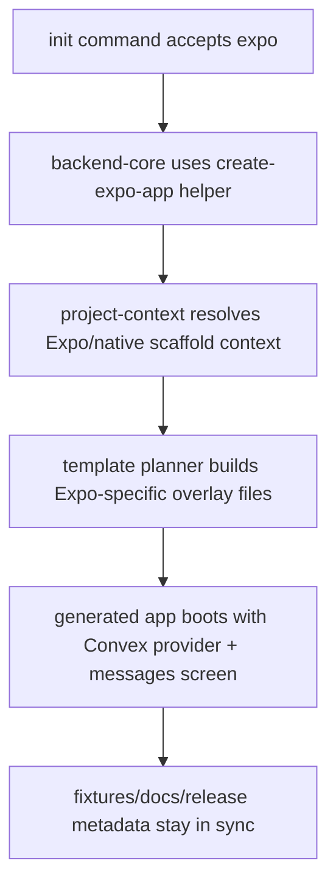

# feat: add Expo init template on the official create-expo-app shell

## Overview

Ship `kitcn init -t expo` as a first-class fresh-scaffold lane built on the
official Expo default template, then layer in the minimum kitcn Convex baseline
and one live messages demo screen.

This should feel like the existing shadcn-owned Next path in spirit, not in
implementation: upstream owns the app shell, kitcn owns the Convex overlay. V1
is intentionally narrow: fresh scaffold only, unauthenticated, plain Expo
styling, and a single-screen launch surface.

## Problem Frame

Today `kitcn init -t` is web-first. Fresh scaffolds support `next`, `start`,
and `vite`, while project detection and overlay logic assume either Next App
Router or web React shells. There is no honest Expo lane, which forces native
users onto foreign scaffolds or manual setup.

The origin doc locks the product shape:

- official Expo shell via `create-expo-app`
- current recommended upstream target is `default@sdk-55` as of April 18, 2026
- single-screen shell, not tabs or drawer
- one live Convex messages demo
- no auth, no existing-app adoption, no styling-stack opinion in v1

## Requirements Trace

Source of truth: [2026-04-18-expo-template-requirements.md](/Users/zbeyens/git/better-convex/docs/brainstorms/2026-04-18-expo-template-requirements.md)

- R1. Scaffold from the official Expo CLI path.
- R2. Treat `create-expo-app` as the source of truth for the shell.
- R3. Verify the upstream target still matches the official Expo recommendation
  at implementation time.
- R4. Produce a single-screen Expo Router shell.
- R5. Overlay the minimum Convex runtime wiring.
- R6. Ship one live messages demo with list + create behavior.
- R7. Replace enough starter content that the app reads as kitcn+Convex, not
  stock Expo.
- R8. Support fresh scaffolding only.
- R9. Do not add Expo auth support in v1.
- R10. Stay on the official Expo baseline styling stack.
- R11. Treat existing Expo adoption as future work.
- R12. Expose `expo` in help text, template validation, and JSON output.
- R13. Add an explicit Expo/native detection and scaffold lane.
- R14. Preserve deterministic `--yes` bootstrap behavior.

## Scope Boundaries

- Include:
  - fresh `kitcn init -t expo`
  - official `create-expo-app` wrapper flow
  - Expo/native project detection and scaffold planning
  - Convex client/provider wiring for Expo
  - one live messages demo
  - docs, skill docs, fixture/template proof, and release metadata
- Exclude:
  - Expo auth support
  - `kitcn add auth` Expo support
  - existing Expo app adoption
  - NativeWind, Unistyles, or other styling-framework selection
  - tabs/drawer starter shell ownership by kitcn
  - `create-better-t-stack` as the generator source of truth

## Context & Research

### Relevant Code and Patterns

- `packages/kitcn/src/cli/backend-core.ts`
  - owns supported init templates, upstream scaffold acquisition, and template
    overlay planning
- `packages/kitcn/src/cli/commands/init.ts`
  - user-facing init help text and handoff contract
- `packages/kitcn/src/cli/project-context.ts`
  - current framework detection and scaffold-context model
- `packages/kitcn/src/cli/test-utils.ts`
  - fake upstream scaffold outputs used by init tests
- `packages/kitcn/src/cli/registry/init/start/*`
  - best current example of adding a framework-specific init branch without
    pretending generic React patches are enough
- `packages/kitcn/src/cli/registry/init/react/init-react-convex-provider.template.ts`
  - reusable provider shape, but currently hardcoded to Vite env access
- `packages/kitcn/src/cli/registry/init/next/init-next-messages.template.ts`
  and `packages/kitcn/src/cli/registry/init/next/init-next-schema.template.ts`
  - current tiny demo and starter schema shapes that may be reused if they stay
    framework-neutral
- `tooling/template.config.ts`, `tooling/scenario.config.ts`, `tooling/scenarios.ts`
  - fixture/template/scenario truth for scaffold lanes

### Local upstream references

- `../expo-template-default/package.json`
  - current official default template package shape
- `../expo-template-default/src/app/_layout.tsx`
  - current upstream root layout seam
- `../expo-template-default/src/app/index.tsx`
  - current starter home screen
- `../expo-template-default/src/app/explore.tsx`
  - current extra route that proves the default shell is multi-screen
- `../expo-template-default/src/components/app-tabs.tsx`
  - current upstream tabs implementation
- `../create-better-t-stack/packages/template-generator/src/processors/env-vars.ts`
  - donor reference for Expo env naming (`EXPO_PUBLIC_CONVEX_URL`)
- `../create-better-t-stack/packages/template-generator/templates/frontend/native/*`
  - donor reference for Expo package/config shapes when the official template
    alone leaves a gap

### Institutional Learnings

- `docs/solutions/workflow-issues/shadcn-pin-bumps-must-sync-scaffold-doubles-and-starters-20260417.md`
  - if init owns a scaffold lane, its test doubles must track the real upstream
    contract
- `docs/solutions/integration-issues/next-monorepo-init-must-target-app-root-and-workspace-package-manager-20260406.md`
  - overlay logic must target the real app root, not a guessed single-app root
- `docs/solutions/integration-issues/published-cli-bootstrap-must-ship-runtime-deps-and-anonymous-convex-init-20260331.md`
  - fresh template lanes must stay honest under published CLI bootstrap
- `docs/solutions/integration-issues/local-auth-env-sync-must-use-real-convex-cli-entrypoint-20260417.md`
  - local bootstrap command paths matter; do not fork runtime invocation style
- `docs/solutions/developer-experience/cyclic-revision-pointer-schemas-need-real-package-resolution-proof-20260417.md`
  - fake fixtures can hide package-resolution truth; proof should use real
    install shapes where possible

### External References

- Expo create-expo-app docs:
  [docs.expo.dev/more/create-expo](https://docs.expo.dev/more/create-expo/)
- Expo project creation docs:
  [docs.expo.dev/get-started/create-a-project](https://docs.expo.dev/get-started/create-a-project/)
- Expo Router intro:
  [docs.expo.dev/router/introduction](https://docs.expo.dev/router/introduction/)

External research stops there. The upstream shell shape is answered by the
local clone of `expo-template-default`, and v1 explicitly excludes auth.

## Key Technical Decisions

### 1. Use a dedicated Expo scaffold helper, not a generalized shadcn helper

`createProjectWithShadcn(...)` should stay shadcn-specific. Expo needs its own
helper in `backend-core.ts` with the same staging semantics for empty target
dirs but a different upstream command contract.

Reason:

- shadcn and Expo have different ownership models and CLI flags
- forcing both through one helper will turn small drift into brittle branching

### 2. Treat Expo as a first-class native scaffold lane, not generic React

`project-context.ts` should gain an explicit Expo/native branch with its own
path assumptions and env keys. Do not route Expo through the current React/Vite
path that expects `main.tsx`, `import.meta.env`, and web entry semantics.

Reason:

- the real upstream shell uses `src/app/_layout.tsx`, `src/app/index.tsx`, and
  Expo Router
- generic React assumptions are the wrong seam

### 3. Keep the v1 overlay narrow and runtime-focused

The overlay should replace only the files that define the user-visible shell
and Convex wiring:

- root layout/provider path
- home screen
- env/package integration
- demo server files when needed

Do not invent a broad delete/cleanup abstraction just to erase every Expo demo
artifact in v1. If dormant upstream helper files remain but the runtime surface
is single-screen and kitcn-owned, that is acceptable for the first cut.

### 4. Reuse framework-neutral server pieces; add Expo-specific client pieces

The server-side starter schema/messages logic should be reused where it is
already framework-agnostic. Client/provider/env templates should be Expo-specific
because the runtime contract differs materially from Next/Start/Vite.

### 5. Proof should favor fixture/template honesty over fake mobile theater

V1 proof should prioritize:

- init contract tests
- scaffold-content assertions
- fixture/template sync
- lint/type-level proof where honest

Do not promise iOS/Android simulator automation unless the repo can actually
run it repeatably. A fake “mobile proof” is worse than a scoped, explicit proof
contract.

## Open Questions

### Resolved During Planning

- Which shell owns the baseline? `create-expo-app`, not `create-better-t-stack`
  and not a handwritten kitcn template.
- Should v1 include auth? No.
- Should v1 support existing Expo app adoption? No.
- Should v1 preserve the upstream multi-screen shell? No. The launch surface
  should be reduced to a single-screen messages app.
- Should v1 choose a styling stack? No. Stay on the official Expo baseline.

### Deferred to Implementation

- Should the Expo overlay physically delete dormant upstream demo files, or only
  replace the runtime-entry files that matter? Defer until the overlay code is
  shaped; avoid a new delete primitive unless clearly justified.
- Should Expo template validation stop at fixture/lint proof, or is there a
  stable `expo start --web` smoke lane worth adding? Defer until implementation
  confirms whether that lane is reliable in this repo.
- Does the current official template still resolve to `default@sdk-55` at build
  time, or has Expo moved the recommended default again? Re-check during
  implementation before hardcoding the helper.

## High-Level Technical Design

> _This illustrates the intended approach and is directional guidance for
> review, not implementation specification._

## Implementation Units

- [ ] **Unit 1: Open the public init contract to `-t expo` and wrap the official Expo scaffold**

**Goal:** make `expo` a real fresh-app template and acquire the upstream shell
through a dedicated Expo helper.

**Requirements:** R1, R2, R12, R14

**Dependencies:** None

**Files:**

- Modify: `packages/kitcn/src/cli/backend-core.ts`
- Modify: `packages/kitcn/src/cli/commands/init.ts`
- Modify: `packages/kitcn/src/cli/cli.ts`
- Modify: `packages/kitcn/src/cli/cli.commands.ts`
- Modify: `packages/kitcn/src/cli/commands/init.test.ts`

**Approach:**

- Add `expo` to `SUPPORTED_INIT_TEMPLATES`, help text, and all user-facing
  error strings that currently lie with `<next|start|vite>`.
- Add a dedicated Expo scaffold helper in `backend-core.ts` that mirrors the
  empty-dir staging behavior used for shadcn scaffolds.
- Keep `runInitCommandFlow(...)` result semantics unchanged so JSON output and
  bootstrap behavior stay stable.

**Execution note:** TDD posture. Update the init contract tests before wiring
the new helper path.

**Patterns to follow:**

- `createProjectWithShadcn(...)` in
  `packages/kitcn/src/cli/backend-core.ts`
- Start template enablement tests in
  `packages/kitcn/src/cli/commands/init.test.ts`

**Test scenarios:**

- Happy path: `resolveSupportedInitTemplate('expo')` succeeds.
- Happy path: `kitcn init -t expo --yes` shells out through the Expo helper and
  records `template: "expo"` in JSON output.
- Edge case: empty existing target dir still stages and moves the generated app
  into place.
- Error path: unsupported-template and removed-create guidance mention `expo`
  alongside the other supported templates.
- Integration: one-shot local Convex bootstrap still runs after template-mode
  init when the backend is Convex.

**Verification:**

- `expo` is visible everywhere the public init contract is described or parsed.

- [ ] **Unit 2: Add an explicit Expo/native scaffold context**

**Goal:** make scaffold planning and framework detection understand Expo as a
native lane with its own path and env assumptions.

**Requirements:** R4, R5, R12, R13, R14

**Dependencies:** Unit 1

**Files:**

- Modify: `packages/kitcn/src/cli/project-context.ts`
- Modify: `packages/kitcn/src/cli/backend-core.ts`
- Modify: `packages/kitcn/src/cli/commands/init.test.ts`
- Modify: `packages/kitcn/src/cli/cli.commands.ts`

**Approach:**

- Add an Expo/native framework detection path keyed off the real upstream shape
  (`expo` deps + Expo Router entry + `src/app/_layout.tsx` style paths).
- Introduce an Expo-native scaffold context instead of forcing Expo through the
  current web React context.
- Give that context the right client env key contract
  (`EXPO_PUBLIC_CONVEX_URL`) and root path assumptions (`src/app/**`,
  `src/components/**`, `src/lib/**`).
- Branch `buildTemplateInitializationPlanFiles(...)` so Expo gets its own owned
  overlay set.

**Patterns to follow:**

- Start-specific branching in
  `buildTemplateInitializationPlanFiles(...)`
- current `resolveProjectScaffoldContext(...)` type split in
  `packages/kitcn/src/cli/project-context.ts`

**Test scenarios:**

- Happy path: the official default Expo scaffold is detected as supported.
- Edge case: Expo lane infers `src/` layout correctly and does not require a
  Vite-style `main.tsx`.
- Error path: unsupported-app detection stays unchanged for non-Expo,
  non-supported projects.
- Integration: Expo scaffold context resolves the correct env key and client
  directories for downstream overlay planning.

**Verification:**

- Expo planning no longer depends on web-only assumptions like `import.meta.env`
  or `main.tsx`.

- [ ] **Unit 3: Build the Expo overlay and single-screen messages demo**

**Goal:** overlay the official Expo shell with kitcn Convex wiring and a single
messages screen.

**Requirements:** R3, R4, R5, R6, R7, R10

**Dependencies:** Unit 2

**Files:**

- Modify: `packages/kitcn/src/cli/backend-core.ts`
- Add: `packages/kitcn/src/cli/registry/init/expo/init-expo-package-json.template.ts`
- Add: `packages/kitcn/src/cli/registry/init/expo/init-expo-env.template.ts`
- Add: `packages/kitcn/src/cli/registry/init/expo/init-expo-convex-provider.template.ts`
- Add: `packages/kitcn/src/cli/registry/init/expo/init-expo-providers.template.ts`
- Add: `packages/kitcn/src/cli/registry/init/expo/init-expo-layout.template.ts`
- Add: `packages/kitcn/src/cli/registry/init/expo/init-expo-messages-screen.template.ts`
- Reuse or modify as needed:
  `packages/kitcn/src/cli/registry/init/next/init-next-messages.template.ts`
- Reuse or modify as needed:
  `packages/kitcn/src/cli/registry/init/next/init-next-schema.template.ts`

**Approach:**

- Keep the official Expo package/app shell as upstream-owned input.
- Layer in Expo-specific client templates for:
  - provider mounting
  - Convex client construction from `EXPO_PUBLIC_CONVEX_URL`
  - root layout that mounts kitcn providers instead of the upstream tab shell
  - one home screen that reads/writes messages
- Reuse existing server/schema/messages starter logic only if it stays truly
  framework-neutral.
- Do not add auth or styling-framework dependencies.
- Do not force a delete abstraction for unused upstream demo files unless the
  implementation proves it is cheap and clearly worth it.

**Patterns to follow:**

- provider/query-client wiring from
  `packages/kitcn/src/cli/registry/init/react/init-react-convex-provider.template.ts`
- small demo posture from
  `packages/kitcn/src/cli/registry/init/next/init-next-messages.template.ts`
- official shell shape from `../expo-template-default/src/app/_layout.tsx`
  and `../expo-template-default/src/app/index.tsx`

**Test scenarios:**

- Happy path: generated Expo app contains `.env` or equivalent client env
  wiring with `EXPO_PUBLIC_CONVEX_URL`.
- Happy path: generated root layout mounts kitcn providers and no longer boots
  the upstream tabs shell.
- Happy path: home screen uses the messages demo rather than the stock Expo
  welcome content.
- Edge case: Expo files use React Native / Expo env access patterns, not
  `next/*` or `import.meta.env`.
- Integration: Convex server starter files still line up with the demo screen's
  list/create contract.
- Regression: auth packages, NativeWind, and Unistyles do not appear in the
  generated package baseline.

**Verification:**

- A fresh scaffold launches into one Convex-backed messages screen on the
  official Expo shell.

- [ ] **Unit 4: Add honest fixture and scaffold proof for the Expo lane**

**Goal:** make the new Expo lane provable in the same fixture/template system
used by the existing scaffold lanes.

**Requirements:** R1 through R7, R12 through R14

**Dependencies:** Unit 3

**Files:**

- Modify: `packages/kitcn/src/cli/test-utils.ts`
- Modify: `packages/kitcn/src/cli/commands/init.test.ts`
- Modify: `packages/kitcn/src/cli/cli.commands.ts`
- Modify: `tooling/template.config.ts`
- Modify: `tooling/scenario.config.ts`
- Modify: `tooling/scenarios.ts`
- Create or refresh: `fixtures/expo/**`

**Approach:**

- Add a test helper that mirrors the real official Expo default template shape
  closely enough that init overlay tests fail when upstream paths drift.
- Add `expo` to the template-fixture config so `fixtures:sync` and
  `fixtures:check` know about the new lane.
- Add scenario/template typing for `expo` where the unions currently hardcode
  `next | start | vite`.
- Keep proof honest: fixture/template sync is mandatory; runtime smoke is only
  added if the repo can support it repeatably without fake mobile claims.

**Patterns to follow:**

- `writeShadcnNextApp(...)`, `writeShadcnStartApp(...)`, and
  `writeShadcnViteApp(...)` in `packages/kitcn/src/cli/test-utils.ts`
- template/scenario registration in `tooling/template.config.ts` and
  `tooling/scenario.config.ts`

**Test scenarios:**

- Happy path: the Expo test double matches the real upstream `src/app/**`
  structure closely enough for overlay tests to exercise the right seams.
- Happy path: `fixtures/expo` syncs from `kitcn init -t expo`.
- Edge case: template/scenario unions accept `expo` without breaking the
  existing next/start/vite lanes.
- Regression: published-package or tarball-backed init tests still resolve the
  generated Expo scaffold against the current package install spec.

**Verification:**

- Expo is part of the fixture/template proof system, not a one-off code path.

- [ ] **Unit 5: Sync docs, skill references, and release metadata**

**Goal:** make the new public template contract visible everywhere users learn
or discover `init -t`.

**Requirements:** R8, R9, R11, R12

**Dependencies:** Units 1 through 4

**Files:**

- Modify: `www/content/docs/index.mdx`
- Modify: `www/content/docs/quickstart.mdx`
- Modify: `www/content/docs/cli/registry.mdx`
- Modify: `www/content/docs/meta.json`
- Add: `www/content/docs/expo.mdx`
- Modify: `www/app/(home)/page.tsx`
- Modify: `packages/kitcn/skills/kitcn/references/setup/index.md`
- Modify: `packages/kitcn/skills/kitcn/references/setup/server.md`
- Add: `packages/kitcn/skills/kitcn/references/setup/expo.md`
- Add: `.changeset/*.md`

**Approach:**

- Add Expo to public entrypoint docs and homepage command examples.
- Document the ownership model plainly: official Expo shell, kitcn Convex
  overlay, single-screen messages demo, auth excluded from v1.
- Mirror any new `www/` docs in the Convex skill references per repo policy.
- Record the published package delta in a changeset instead of ad-hoc changelog
  edits.

**Patterns to follow:**

- `www/content/docs/tanstack-start.mdx`
- existing setup references under
  `packages/kitcn/skills/kitcn/references/setup/`

**Test scenarios:**

- Happy path: public docs list Expo alongside the supported fresh-app templates.
- Regression: docs do not claim Expo auth or existing-app adoption support that
  v1 does not actually ship.
- Regression: skill docs and `www/` docs stay aligned on the same contract.

**Verification:**

- Users can discover the Expo template without stale or contradictory guidance.

## System-Wide Impact

- **Interaction graph:** `handleInitCommand(...)` ->
  `runInitCommandFlow(...)` -> scaffold helper -> project-context resolution ->
  template plan files -> dependency install -> codegen/bootstrap.
- **Error propagation:** upstream Expo template drift should fail early with a
  scaffold-shape error before patch logic silently writes nonsense.
- **State lifecycle risks:** Expo env handling moves client runtime access from
  `NEXT_PUBLIC_*` / `VITE_*` assumptions to `EXPO_PUBLIC_*`; this must stay
  isolated to the Expo lane.
- **API surface parity:** help text, removed-create messaging, JSON output,
  template unions, fixtures, docs, homepage commands, and skill references all
  need the same `expo` contract.
- **Integration coverage:** init contract tests alone are not enough; fixture
  sync and template registration must also be updated so the new lane stays
  honest over time.
- **Unchanged invariants:** `kitcn add auth` remains unsupported for Expo in v1,
  existing `next`, `start`, and `vite` paths should behave exactly as before,
  and no styling-framework dependency is added by default.

## Risks & Dependencies

| Risk                                                                                 | Mitigation                                                                                                        |
| ------------------------------------------------------------------------------------ | ----------------------------------------------------------------------------------------------------------------- |
| Official Expo template structure drifts under `create-expo-app`                      | Keep the overlay narrow, mirror the real template in test utils, and fail loudly on unexpected path/shape changes |
| Expo gets misrouted through generic React assumptions                                | Add a dedicated Expo/native scaffold context and branch the planner explicitly                                    |
| Mobile proof gets faked because simulator automation is inconvenient                 | Treat fixture/template proof as mandatory, and only add runtime smoke if the lane is actually repeatable          |
| Upstream default shell is multi-screen while v1 wants a single-screen launch surface | Replace the runtime-entry layout/home files and avoid unnecessary abstraction for full starter cleanup            |
| Public docs overpromise Expo auth/adoption                                           | Keep scope boundaries explicit in docs and skill references                                                       |

## Documentation / Operational Notes

- Any `www/` doc change must be mirrored in
  `packages/kitcn/skills/kitcn/references/setup/`.
- Because this changes a published package surface under `packages/kitcn`, the
  implementation must include a changeset and run
  `bun --cwd packages/kitcn build`.
- Because this changes `init -t` scaffold output, implementation must run:
  - `bun run fixtures:sync`
  - `bun run fixtures:check`
- Runtime proof should use prepared scenario/template apps or fixture checks,
  not committed fixtures run in place.

## Sources & References

- **Origin document:** [expo-template requirements](/Users/zbeyens/git/better-convex/docs/brainstorms/2026-04-18-expo-template-requirements.md)
- Related code:
  - `packages/kitcn/src/cli/backend-core.ts`
  - `packages/kitcn/src/cli/project-context.ts`
  - `packages/kitcn/src/cli/test-utils.ts`
  - `tooling/template.config.ts`
  - `tooling/scenario.config.ts`
- Local upstream references:
  - `../expo-template-default/src/app/_layout.tsx`
  - `../expo-template-default/src/app/index.tsx`
  - `../expo-template-default/src/app/explore.tsx`
  - `../expo-template-default/src/components/app-tabs.tsx`
  - `../create-better-t-stack/packages/template-generator/src/processors/env-vars.ts`
- External docs:
  - [Expo create-expo-app](https://docs.expo.dev/more/create-expo/)
  - [Expo create a project](https://docs.expo.dev/get-started/create-a-project/)
  - [Expo Router introduction](https://docs.expo.dev/router/introduction/)

## Alternative Approaches Considered

| Approach                                                                              | Why not chosen                                                                                   |
| ------------------------------------------------------------------------------------- | ------------------------------------------------------------------------------------------------ |
| Handwrite a full kitcn-owned Expo shell                                               | Creates permanent template ownership and drift burden for a problem Expo already solves upstream |
| Use `create-better-t-stack` as the scaffold owner                                     | Wrong ownership model for `kitcn init -t`; useful donor, bad source of truth                     |
| Start from `create-expo-app --template blank-typescript` and rebuild Router ourselves | More local surface area, less parity with Expo's official recommendation, worse drift story      |

## Success Metrics

- `kitcn init -t expo --yes` is a supported public contract.
- The generated app launches into a single-screen messages experience backed by
  Convex.
- The Expo lane stays clearly scoped: no auth, no adoption, no styling-stack
  opinion.
- Fixture/template proof exists so future upstream Expo changes are caught
  quickly.
